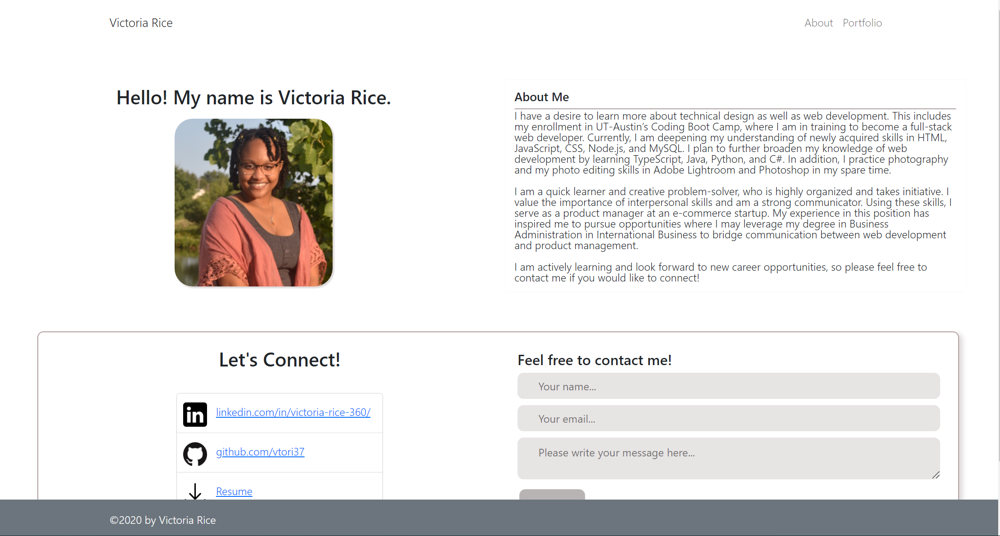

# Victoria Rice Portfolio

## Description
Created using React, this application serves as a portfolio website that includes an about page, a portfolio, a downloadable resume, and a contact form. 

## Table of Contents 
* [Website](#website)
* [Contributors](#contributors)
* [Author](#author)
* [Technology](#technology)
* [Questions](#Questions)

***

## Website
Here is a link to the deployed application:
[Victoria's Portfolio](https://victoria-port.herokuapp.com/About)

## Author
[Victoria Rice](https://github.com/vtori37)

## Technology
* CSS 
* JS
* React
* Bootstrap
* Heroku

### Questions
If you have any questions or concerns regarding this project, feel free to reach out to Victoria Rice at vrice360@gmail.com.
